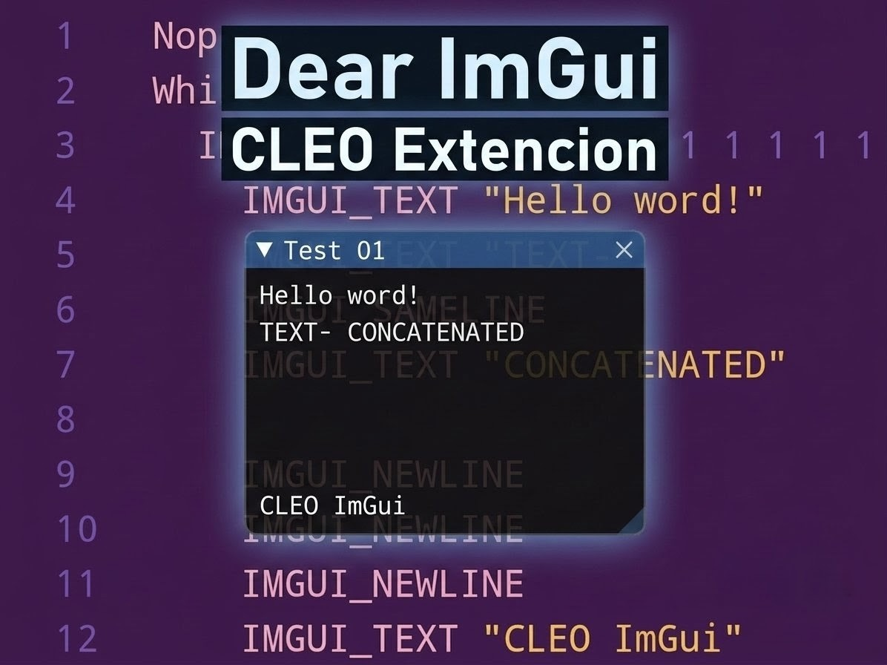

# CLEO ImGui Mobile
Project inspired by [CLEO ImGui](https://github.com/user-grinch/CLEOImGui) by User-Grinch, respecting the order of its opcodes.

Created by: Matias A. Rossi (MatiDragon)

----

The project offers partial support for PC opcodes in Android.

<h2>CHANGE LOG</h2>

### ImGui v1.3.0

The IDs of many opcodes were changed because they conflicted with other extensions such as CLEO+ and CLEO5.

New order:

* `2300-235A -> 7100-715A` : **ImGui Mobile** with **CLEO 5**
* `0F01-0F17 -> 715B-7170` : **ImGui** with **CLEO Plus**

The missing vertical sliders were added (7171-7172).

### ImGui v1.2.0

Almost all the opcodes from CLEO ImGui (0F01-0F63) and CLEO ImGui Redux (2202-2250) were added.
Expanding opcodes () to have Trees, Checkboxes, Labels, Menus, Tables, etc.
Special opcodes to use the ImGui keyboard regardless of whether you use ImGui in your script or not.

I implemented the opcodes to load images, but I don't know exactly where they are loaded from.
The algorithm would have to be this:
* IMGUI_LOAD_IMAGE ! If an image could not be loaded, it returns -1; otherwise, it keeps the same ID.
* IMGUI_FREE_IMAGE ! It removes the map reference, but doesn't release the texture from the GPU (due to a lack of API). It's used to upload edited images.

### ImGui v1.1.1

Support for virtual keyboard inputs.

Implemented opcodes of "CLEO ImGui Redux".

### ImGui v1.1.0

Added opcodes:
* IMGUI_IS_ITEM_HOVERED
* IMGUI_IS_ITEM_FOCUSED
* IMGUI_IS_ITEM_ACTIVATED
* IMGUI_IS_ITEM_DEACTIVATED
* IMGUI_IS_ITEM_ACTIVE
* IMGUI_IS_ITEM_CLICKED
* IMGUI_IS_WINDOW_HOVERED
* IMGUI_IS_WINDOW_FOCUSED

### ImGui v1.0.1

Arranged conditionals:
* IMGUI_CHECKBO
* IMGUI_BUTTON
* IMGUI_SLIDER_INT
* IMGUI_SLIDER_FLOAT
* IMGUI_COLOR_EDIT
* IMGUI_COLOR_PICKER
* IMGUI_INPUT_INT
* IMGUI_INPUT_FLOAT
* IMGUI_MENU_ITEM 
* IMGUI_RADIO_BUTTON
* IMGUI_COLLAPSING_HEADER
* IMGUI_SELECTABLE
* IMGUI_INVISIBLE_BUTTON
* IMGUI_MENU_ITEM

Functions fixed:
* IMGUI_COLOR_TOOLTIP (COLOR)

Fixed returns:
* IMGUI_GET_CLEO_IMGUI_VERSION (STRING)
* IMGUI_GET_VERSION (STRING)

### ImGui v1.0.0

Added opcodes:
* IMGUI_BEGIN
* IMGUI_END
* IMGUI_CHECKBOX
* IMGUI_BUTTON
* IMGUI_TEXT
* IMGUI_TEXT_WRAPPED
* IMGUI_TEXT_DISABLED
* IMGUI_TEXT_COLORED
* IMGUI_COLUMNS
* IMGUI_NEXT_COLUMN
* IMGUI_SPACING
* IMGUI_DUMMY
* IMGUI_SAMELINE
* IMGUI_SLIDER_INT
* IMGUI_SLIDER_FLOAT
* IMGUI_COLOR_EDIT
* IMGUI_COLOR_PICKER
* IMGUI_BEGIN_CHILD
* IMGUI_END_CHILD
* IMGUI_INPUT_INT
* IMGUI_INPUT_FLOAT
* IMGUI_SEPARATOR
* IMGUI_GET_CLEO_IMGUI_VERSION
* IMGUI_GET_VERSION
* IMGUI_GET_FRAMERATE
* IMGUI_COLOR_BUTTON
* IMGUI_BULLET
* IMGUI_BULLET_TEXT
* IMGUI_NEWLINE
* IMGUI_SET_TOOLTIP
* IMGUI_COLOR_TOOLTIP
* IMGUI_RADIO_BUTTON
* IMGUI_COLLAPSING_HEADER
* IMGUI_PROGRESS_BAR
* IMGUI_GET_WINDOW_POSY
* IMGUI_GET_WINDOW_POSX
* IMGUI_GET_WINDOW_WIDTH
* IMGUI_GET_WINDOW_HEIGHT
* IMGUI_SELECTABLE
* IMGUI_INVISIBLE_BUTTON
* IMGUI_DRAWLIST_ADD_CIRCLE
* IMGUI_DRAWLIST_ADD_CIRCLE_FILLED
* IMGUI_DRAWLIST_ADD_RECT
* IMGUI_DRAWLIST_ADD_RECT_FILLED
* IMGUI_DRAWLIST_ADD_RECT_FILLED_MULTICOLOR
* IMGUI_DRAWLIST_ADD_TEXT
* IMGUI_DRAWLIST_ADD_TRIANGLE
* IMGUI_DRAWLIST_ADD_TRIANGLE_FILLED
* IMGUI_BEGIN_MAIN_MENU_BAR
* IMGUI_END_MAIN_MENU_BAR
* IMGUI_MENU_ITEM
* IMGUI_STYLE_COLORS_CLASSIC
* IMGUI_STYLE_COLORS_DARK
* IMGUI_STYLE_COLORS_DEFAULT
* IMGUI_STYLE_COLORS_LIGHT
* IMGUI_GET_STYLE
* IMGUI_SET_STYLE
* IMGUI_SET_STYLE_INT
* IMGUI_GET_COLOR
* IMGUI_SET_COLOR
* IMGUI_PUSH_ITEM_WIDTH
* IMGUI_POP_ITEM_WIDTH
* IMGUI_PUSH_ITEM_FLAG
* IMGUI_POP_ITEM_FLAG
* IMGUI_GET_WINDOW_CONTENT_REGION_WIDTH
* IMGUI_GET_FRAME_HEIGHT
* IMGUI_GET_FRAME_HEIGHT_WITH_SPACING
* IMGUI_GET_STYLE_INT